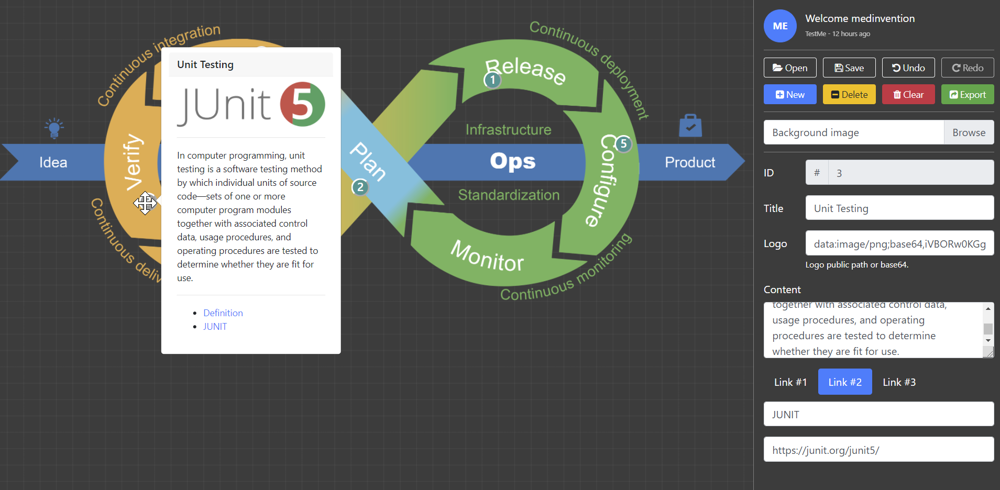
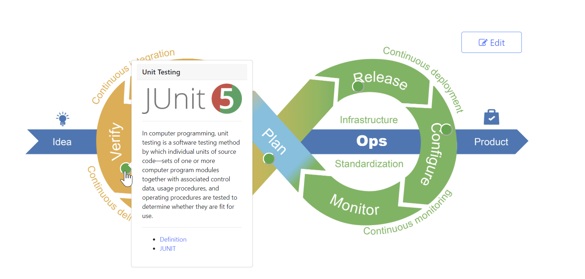
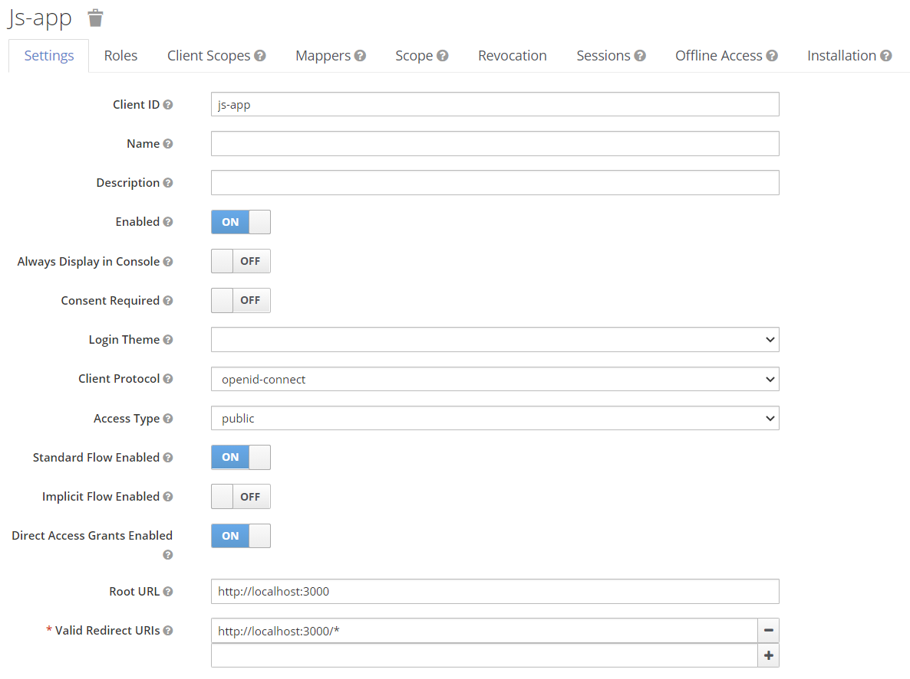

# Marker for interactive board
Add a pop markers to your boards for communication.

<p>
  
  
</p>

## 1- Deploy KeyCloak for SSO:
  * [Local standalone for testing / developpement](https://www.keycloak.org/docs/latest/server_installation/) 
  * [K8S deploy configuration example (single node)](https://github.com/mmohamed/k8s-raspberry/blob/master/deployment/keycloak.yaml.dist)
  * [Keycloak on Docker](https://www.keycloak.org/getting-started/getting-started-docker)

## 2- KeyCloak configuration:
Define a simple **Web application** in your [Keycloak](https://github.com/keycloak/keycloak) instance.
Then, copy the installation configuration.

```json
{
  "realm": "master",
  "auth-server-url": "http://localhost:8080/auth/",
  "ssl-required": "external",
  "resource": "marker",
  "public-client": true
}
```
<!---  --->

## 2- Deploy Marker Application Backend
  * [Local](server/) :
  ```bash
  # cd server
  pipenv install
  # edit configuration file .env (KEYCLOAK_REALM, KEYCLOAK_URL, KEYCLOAK_APP)
  # your can set DB_PATH env var to set an sqlLite3 DB path (defaut is workdir)
  pipenv run python main.py
  ```

  * [Kubernetes](kubernetes/) :
  ```bash
  # cd kubernetes
  kubectl create ns marker
  kubectl apply -f  server/ -n marker
  ```

## 3- Deploy Marker Application Front
  * [Local](/) :
  ```bash
  # export NPM_CONFIG_PREFIX=./app_node_modules (if you want use another loccation for modules)
  npm install 
  # edit configuration file .env (REACT_APP_KEYCLOAK_REALM, REACT_APP_KEYCLOAK_URL, REACT_APP_KEYCLOAK_APP REACT_APP_API_URL_BASE)
  npm start
  ```

  * [Kubernetes](kubernetes/) :
  ```bash
  # cd kubernetes
  kubectl apply -f ui/ -n marker
  ```


----
### *Build or rebuild Server, UI and docker images*
Using [Makefile](Makefile), build one or all part of application :
```bash
make all # build ui, server and docker (with buildx : cross arch)
make build-ui # build ui only
make build-server # build server only
make clean mostlyclean # fast clean & all
```
---- 

[*More information*](https://blog.medinvention.dev)
